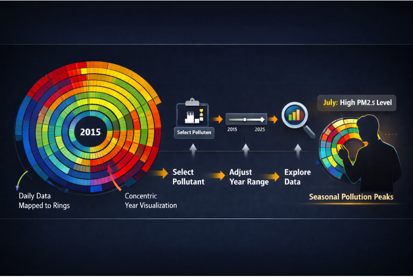
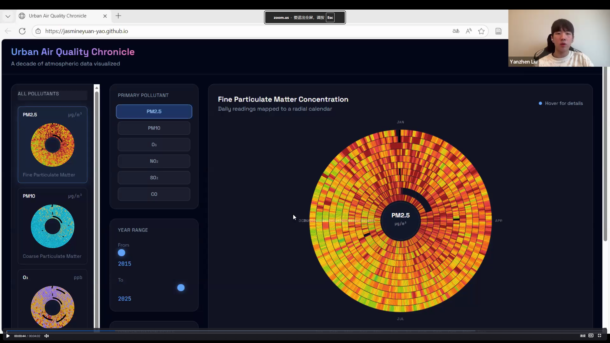
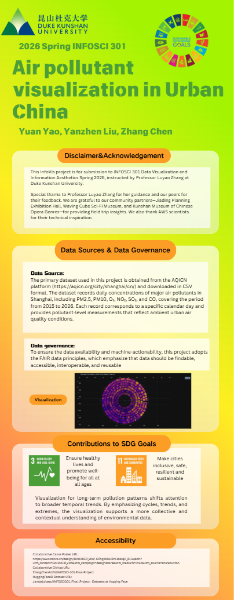

<h1 align="center" style="font-size:40px;">
Air Pollutant Visualization in Urban China
</h1>

  <!-- Upload to: assets/teaser.png -->
  

---

## Abstract

This project presents an interactive radial heatmap visualization designed to support long-term understanding of Shanghai’s urban air quality. Using daily AQICN data from 2015–2026 (PM2.5, PM10, O₃, NO₂, SO₂, CO), the system encodes day-of-year as angular position, year as concentric rings, and pollutant concentration as color intensity. The cyclic radial structure highlights seasonal peaks while preserving stable year-to-year comparison. Users can switch pollutants, adjust year ranges, and hover for precise daily statistics to enable structured exploration.

The prototype targets residents, students, educators, and civic planners who require accessible yet reliable environmental insight. Rather than functioning as a simple dashboard, the visualization emphasizes interpretation safety, legend consistency, and comparative clarity. By framing air quality as a long-term narrative instead of isolated snapshots, the system supports informed public discussion and sustainability literacy aligned with SDG 3, SDG 4, and SDG 11.

---

## Academic Professionalism

### Disclaimer

This InfoVis project is for submission to INFOSCI 301 Data Visualization and Information Aesthetics Spring 2026, instructed by Professor Luyao Zhang at Duke Kunshan University.

---

### Acknowledgments

We thank Professor Luyao Zhang for guidance on visualization theory, community-based learning, and ethical design. We acknowledge peer classmates for critique feedback and iteration discussions. Field research experiences at the Jiading District Urban Planning Exhibition Hall, Fengxian Waving Cube Sci-Fi Immersive Museum, and the Kunshan Museum of Chinese Opera Genres informed the project’s narrative framing of long-term environmental storytelling. We also appreciate insights from industry contributors, including discussion with an AWS scientist, which strengthened our understanding of data infrastructure and transparency.

---

### Contribution to SDG Goals

**SDG 3: Good Health and Well-Being**  
The prototype increases public awareness of air pollution exposure patterns and seasonal health risks through interpretable multi-year trend comparison.

**SDG 4: Quality Education**  
The visualization functions as a teaching tool for understanding environmental cycles, long-term change, and responsible interpretation of quantitative data.

**SDG 11: Sustainable Cities and Communities**  
By presenting longitudinal urban air-quality trajectories, the system supports informed civic dialogue on sustainability and urban environmental governance.

---

### Statement of Accessibility

**Repository**  
https://github.com/ZhangChenALEX/INFOSCI-301-Final-Project  

**Hugging Face Dataset**  
https://huggingface.co/datasets/Jambajuicezc/INFOSCI301_Final_Project  

**Interactive Demo**  
https://jasmineyuan-yao.github.io/

## Teaser Video

Click the thumbnail below to watch the project overview.

  

The visualization is web-based and compatible with modern browsers. Design decisions follow accessibility principles outlined in the SIGCHI accessibility guidelines (https://sigchi.org/resources/guides-for-authors/accessibility/), including readable color gradients, clear legends, structured interaction patterns, and reduced cognitive load in cross-year comparisons. Source code and processed datasets are publicly available to ensure transparency and reproducibility.

---

## Keywords

information visualization · radial heatmap · air quality analytics · long-term environmental trends · interactive web visualization · community-based learning · dashboard ethics · sustainability communication

---

## Teaser Video

Watch the project overview presentation:  
https://duke.zoom.us/rec/share/NkxJNIgDXu4bbl99hyty_gnLnaQ-rDuVoSwi1o4qTjkZz0MmSbFtAeFOg-voKCNp.ReZqRRtnqbPGtHhY?startTime=1771141885000  

---

## Collaborative Canva Poster

  <!-- Upload exported poster preview image to: assets/poster_preview.png -->
  

